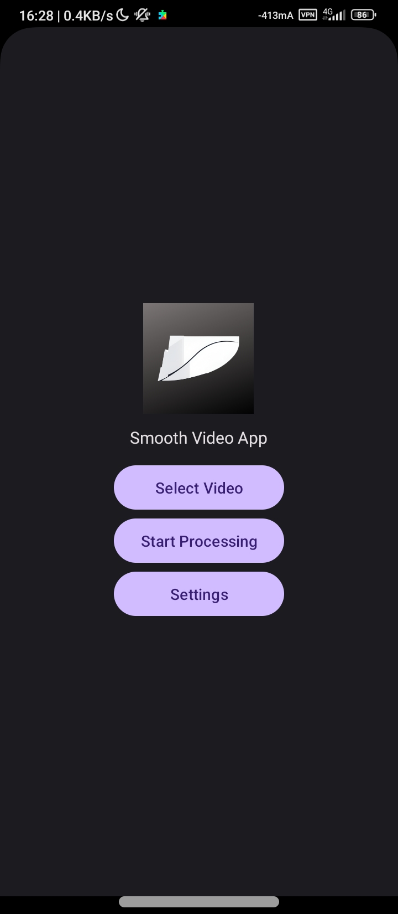
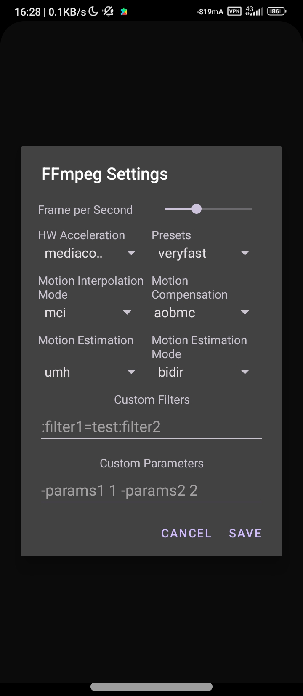

# SmoothVideo
Smooth Video Player which is based on ffmpegkit.

# Preview
<table style="padding:10px">
  <tr>
    <td>
        
    </td>
    <td>
        
    </td>
    <td>
        
    </td>
   <td>
        
    </td>
   </tr>
</table>

# Special Thanks
- ChatGPT-4o